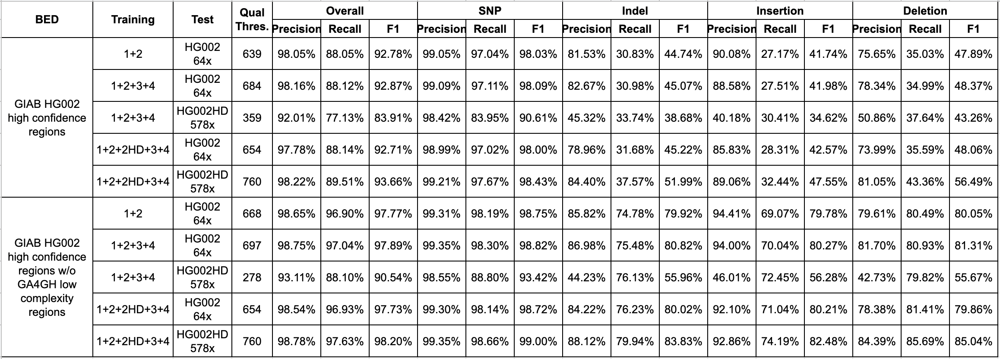

<div align="center">
  <a href="https://en.wiktionary.org/wiki/%E7%9C%BC" target="_blank">
    
  </a>
</div>

# Clair - deep neural network based variant caller

[](https://opensource.org/licenses/BSD-3-Clause) [](http://bioconda.github.io/recipes/clair/README.html) \
Contact: Ruibang Luo \
Email: rbluo@cs.hku.hk

---

## Introduction

Single-molecule sequencing technologies have emerged in recent years and revolutionized structural variant calling, complex genome assembly, and epigenetic mark detection. However, the lack of a highly accurate small variant caller has limited the new technologies from being more widely used. In this study, we present Clair, the successor to Clairvoyante, a program for fast and accurate germline small variant calling, using single molecule sequencing data. For ONT data, Clair achieves the best precision, recall and speed as compared to several competing programs, including Clairvoyante, Longshot and Medaka. Through studying the missed variants and benchmarking intentionally overfitted models, we found that Clair may be approaching the limit of possible accuracy for germline small variant calling using pileup data and deep neural networks.

This is the formal release of Clair (Clair v2, Dec 2019). You can find the experimental Clair v1 (Jan 2019) at [https://github.com/aquaskyline/Clair](https://github.com/aquaskyline/Clair). The preprint of Clair v2 is available in [bioRxiv](https://www.biorxiv.org/content/10.1101/865782v2).

---

## Contents

- [What are we working on right now](#what-are-we-working-on-right-now)
- [What's new](#whats-new)
- [Installation](#installation)
- [Quick Demo](#quick-demo)
- [Usage](#usage)
- [What's new](#what's_new)
- [Submodule Descriptions](#submodule-descriptions)
- [Download Pretrained Models](#pretrained-models)
- [Advanced Guides](#advanced-guides)
- [Model Training](docs/TRAIN.md)
- [Post Processing](docs/POST_PROCESSING.md)

---

## What are we working on right now?

* A full alignment representation for higher performance in the low complexity genomics regions.
* Testing small technics to resolve some complex variants, e.g. a deletion that spans a SNP closely followed.

---

## What's new?

* 20200416
    - added two new options for haploid calling, `--haploid_precision` and `--haploid_sensitive` (in [#24](https://github.com/hku-bal/clair/issues/24))
    - added a simple after calling solution to handle overlapped variants (in [#15](https://github.com/hku-bal/clair/issues/15))
    - fixed haploid GT output (in [#17](https://github.com/hku-bal/clair/issues/17))
* 20200309
    - an ONT model trained with up to 578-fold coverage HG002 data from [The Human Pangenome Reference Consortium](https://humanpangenome.org/data/) is now available in [Pretrained Models](#pretrained-models). The below table shows the biased test results, i.e. testing samples were included in training, thus are not for benchmarking but suggest the performance cap of each model at different coverages. The new model shows significantly improved performance at high coverages.



---

## Installation

### Option 1. Bioconda

```bash
# make sure channels are added in conda
conda config --add channels defaults
conda config --add channels bioconda
conda config --add channels conda-forge

# create conda environment named "clair-env"
conda create -n clair-env -c bioconda clair
conda activate clair-env

# store clair.py PATH into $CLAIR variable
CLAIR=`which clair.py`

# run clair like this afterwards
python $CLAIR --help
```

The conda environment has the Pypy3 interpreter installed, but one Pypy3 package `intervaltree` is still missing. The reason why this is not installed by default is because this is not yet available in any conda repositories. To install the package for Pypy3, after activating the conda environment, please run the following commands:

```bash
pypy3 -m ensurepip
pypy3 -m pip install --no-cache-dir intervaltree==3.0.2
```

Then download the trained models:

```bash
# download the trained model for ONT
mkdir ont && cd ont
wget http://www.bio8.cs.hku.hk/clair_models/ont/122HD34.tar
tar -xf 122HD34.tar
cd ../

# download the trained model for PacBio CCS
mkdir pacbio && cd pacbio
wget http://www.bio8.cs.hku.hk/clair_models/pacbio/ccs/15.tar
tar -xf 15.tar
cd ../

# download the trained model for Illumina
mkdir illumina && cd illumina
wget http://www.bio8.cs.hku.hk/clair_models/illumina/12345.tar
tar -xf 12345.tar
cd ../
```

### Option 2. Build an anaconda virtual environment step by step
#### Please install anaconda using the installation guide at https://docs.anaconda.com/anaconda/install/

```bash
# create and activate the environment named clair
conda create -n clair python=3.7
conda activate clair

# install pypy and packages on clair environemnt
conda install -c conda-forge pypy3.6
pypy3 -m ensurepip
pypy3 -m pip install intervaltree==3.0.2

# install python packages on clair environment
pip install numpy==1.18.0 blosc==1.8.3 intervaltree==3.0.2 tensorflow==1.13.2 pysam==0.15.3 matplotlib==3.1.2
conda install -c anaconda pigz==2.4
conda install -c conda-forge parallel=20191122 zstd=1.4.4
conda install -c bioconda samtools=1.10 vcflib=1.0.0 bcftools=1.10.2

# clone Clair
git clone https://github.com/HKU-BAL/Clair.git
cd Clair
chmod +x clair.py
export PATH=`pwd`":$PATH"

# store clair.py PATH into $CLAIR variable
CLAIR=`which clair.py`

# run clair like this afterwards
python $CLAIR --help
```

Then download the trained models referring to `download the trained model` in [Installation - Option 1](#option-1-bioconda)

### Option 3. Docker

```bash
# clone Clair
git clone https://github.com/HKU-BAL/Clair.git
cd Clair

# build a docker image named clair_docker_image
docker build -f ./Dockerfile -t clair_docker_image . # You might need root privilege

# run docker image
docker run -it clair_docker_image # You might need root privilege

# store clair.py PATH into $CLAIR variable
CLAIR=`which clair.py`

# run clair like this afterwards
python $CLAIR --help
```

Then download the trained models referring to `download the trained model` in [Installation - Option 1](#option-1-bioconda)


### After Installation

To check the version of Tensorflow you have installed:

```bash
python -c 'import tensorflow as tf; print(tf.__version__)'
```

To do variant calling using trained models, CPU will suffice. Clair uses 4 threads by default in `callVarBam`. The number of threads to be used can be controlled using the parameter `--threads`. To train a new model, a high-end GPU and the GPU version of Tensorflow is needed. To install the GPU version of tensorflow:

```bash
pip install tensorflow-gpu==1.13.2
```

The installation of the `blosc` library might fail if your CPU doesn't support the AVX2 instruction set. Alternatively, you can compile and install from the latest source code available in [GitHub](https://github.com/Blosc/python-blosc) with the `DISABLE_BLOSC_AVX2` environment variable set.

---

## Quick demo

* Step 1. Install Clair, preferably using [Installation - Option 1](#option-1-bioconda)
* Step 2. Run

```bash
conda activate clair-env
mkdir clairDemo
cd clairDemo
wget 'http://www.bio8.cs.hku.hk/clair_models/demo/clairDemo.sh'
bash clairDemo.sh
```

* Step 3. Check the results using `less -S ./training/chr21.vcf`

---

## Usage

### General usage

```bash
CLAIR="[PATH_TO_CLAIR]/clair.py"

# to run a submodule using python
python $CLAIR [submodule] [options]

# to run a Pypy-able submodule using pypy (if `pypy3` is the executable command for Pypy)
pypy3 $CLAIR [submodule] [options]
```

### Setup variables for variant calling commands afterwards

```bash
CLAIR="[PATH_TO_CLAIR]/clair.py"                         # e.g. clair.py
MODEL="[MODEL_PATH]"                                     # e.g. [PATH_TO_CLAIR_MODEL]/ont/model
BAM_FILE_PATH="[YOUR_BAM_FILE]"                          # e.g. chr21.bam
REFERENCE_FASTA_FILE_PATH="[YOUR_REFERENCE_FASTA_FILE]"  # e.g. chr21.fa
KNOWN_VARIANTS_VCF="[YOUR_VCF_FILE]"                     # e.g. chr21.vcf
```

#### Notes

* Each model has three files `model.data-00000-of-00001`, `model.index`, `model.meta`. Please give the `MODEL` variable, the prefix `model`.

### Call variants at known variant sites or in a chromosome  (using `callVarBam`)

**For whole genome variant calling, please use `callVarBamParallel` to generate multiple commands that invoke `callVarBam` on smaller chromosome chucks.**

#### Call variants in a chromosome

```bash
# variables
VARIANT_CALLING_OUTPUT_PATH="[YOUR_OUTPUT_PATH]"         # e.g. calls/chr21.vcf (please make sure the directory exists)
CONTIG_NAME="[CONTIG_NAME_FOR_VARIANT_CALLING]"          # e.g. chr21
SAMPLE_NAME="[SAMPLE_NAME]"                              # e.g. HG001

python $CLAIR callVarBam \
--chkpnt_fn "$MODEL" \
--ref_fn "$REFERENCE_FASTA_FILE_PATH" \
--bam_fn "$BAM_FILE_PATH" \
--ctgName "$CONTIG_NAME" \
--sampleName "$SAMPLE_NAME" \
--call_fn "$VARIANT_CALLING_OUTPUT_PATH"

cd "$VARIANT_CALLING_OUTPUT_PATH"
```

#### Call variants at known variant sites in a chromosome

```bash
# variables
VARIANT_CALLING_OUTPUT_PATH="[YOUR_OUTPUT_PATH]"         # e.g. calls/chr21.vcf (please make sure the directory exists)
CONTIG_NAME="[CONTIG_NAME_FOR_VARIANT_CALLING]"          # e.g. chr21
SAMPLE_NAME="[SAMPLE_NAME]"                              # e.g. HG001
KNOWN_VARIANTS_VCF="[YOUR_VCF_PATH]"                     # e.g. chr21_candidates.vcf

python $CLAIR callVarBam \
--chkpnt_fn "$MODEL" \
--ref_fn "$REFERENCE_FASTA_FILE_PATH" \
--bam_fn "$BAM_FILE_PATH" \
--ctgName "$CONTIG_NAME" \
--sampleName "$SAMPLE_NAME" \
--vcf_fn "$KNOWN_VARIANTS_VCF" \
--call_fn "$VARIANT_CALLING_OUTPUT_PATH" \

cd "$VARIANT_CALLING_OUTPUT_PATH"
```

### Call whole-genome variants in parallel (using `callVarBamParallel`)

```bash
# variables
SAMPLE_NAME="NA12878"
OUTPUT_PREFIX="call/var"                        # please make sure the call/ directory exists

# create command.sh for run jobs in parallel
python $CLAIR callVarBamParallel \
--chkpnt_fn "$MODEL" \
--ref_fn "$REFERENCE_FASTA_FILE_PATH" \
--bam_fn "$BAM_FILE_PATH" \
--threshold 0.2 \
--sampleName "$SAMPLE_NAME" \
--output_prefix "$OUTPUT_PREFIX" > command.sh

# disable GPU if you have one installed
export CUDA_VISIBLE_DEVICES=""

# run Clair with 4 concurrencies
cat command.sh | parallel -j4

# Find incomplete VCF files and rerun them
for i in OUTPUT_PREFIX.*.vcf; do if ! [ -z "$(tail -c 1 "$i")" ]; then echo "$i"; fi ; done | grep -f - command.sh | sh

# concatenate vcf files and sort the variants called
vcfcat ${OUTPUT_PREFIX}.*.vcf | bcftools sort -m 2G | bgziptabix snp_and_indel.vcf.gz
```

#### Notes
##### Parallelization

* `callVarBamParallel` generates a file of `callVarBam` commands that can be run in parallel.
* **Use GNU parallel to run commands in parallel** - `parallel -j4` will run four concurrencies in parallel using GNU parallel. We suggest using half the number of available CPU cores.
* **An alternative to GNU parallel** - If [GNU parallel](https://www.gnu.org/software/parallel/) is not installed, please try ```awk '{print "\""$0"\""}' commands.sh | xargs -P4 -L1 sh -c```
##### Options
* **Haploid Precision Mode** - Use `--haploid_precision` option for haploid samples \
(output homozygous variants only).
* **Haploid Sensitive Mode** - Use `--haploid_sensitive` option for haploid samples \
(output all variants except variants with genotype 1/2).
* **Choosing genome sequences and positions for variant calling** - callVarBamParallel by default will generate commands for chromosome {1..22},X,Y (insensible to the "chr" prefix). To call variants in other sequences, you can either input via the option `--bed_fn` your own BED file with three columns including the target sequence names, starting positions and ending positions, or use the option `--includingAllContigs` to include all sequences in the input FASTA file. If you work on a non-human sample, please always use a BED file or the `--includingAllContigs` option to define the sequences you want Clair to work on.
* **For more accurate Indel calling** - You may consider using the `--pysam_for_all_indel_bases` option for more accurate Indel results. On Illumina data and PacBio CCS data, the option requires 20% to 50% longer running time. On ONT data, Clair can run up to ten times slower, while the improvement in accuracy is not significant.
##### Other considerations
* **Setting an appropriate allele frequency cutoff** - Please refer to [About Setting the Alternative Allele Frequency Cutoff](#about-setting-the-alternative-allele-frequency-cutoff)
* **Check for incomplete (unfinished) VCF files** - Incomplete VCF files happens when 'out of memory' or other errors occur. The command in the example finds for a newline at the end of the VCF files, and regenerate the incomplete files.
* **Disabling GPU: Clair uses CPU for variant calling** - To avoid the tensorflow library from using GPU, `CUDA_VISIBLE_DEVICES=""` makes GPUs invisible to Clair so it will only use CPU for variant calling. Please notice that unless you want to run `commands.sh` in serial, you cannot use GPU because one running copy of Clair will occupy all available memory of a GPU. While the bottleneck of `callVarBam` is at the `CreateTensor` script, which only runs on CPU, the effect of GPU accelerate is insignificant (roughly just about 15% faster). But if you have multiple GPU cards in your system, and you want to utilize them in variant calling, you may want to split the `commands.sh` into parts, and run the parts by firstly `export CUDA_VISIBLE_DEVICES="$i"`, where `$i` is an integer from 0 identifying the ID of the GPU to be used.
* **Concatenating results** - `vcfcat` and `bgziptabix` commands are from [vcflib](https://github.com/vcflib/vcflib), and are installed by default.

---

## Submodule Descriptions

Submodules in __`clair/`__ are for variant calling and model training. Submodules in __`dataPrepScripts`__ are for data preparation.

*For the submodules listed below, you use the `-h` or `--help` option for available options.*

`clair/` | Note: submodules under this folder are Pypy incompatible, please run using Python
---: | ---
`call_var` | Call variants using candidate variant tensors.
`callVarBam` | Call variants directly from a BAM file.
`callVarBamParallel` | Generate `callVarBam` commands that can be run in parallel. A BED file is required to specify the regions for variant calling. `--refChunkSize` set the genome chuck size per job.
`evaluate` | Evaluate a model.
`plot_tensor` | Create high resolution PNG figures to visualize input tensor.
`train` |  Training a model using adaptive learning rate decay. By default, the learning rate will decay for three times. Input a binary tensors file created by `Tensor2Bin` is highly recommended.
`train_clr` | Training a model using Cyclical Learning Rate (CLR).


`dataPrepScripts/` | Note: submodules under this folder is Pypy compatiable unless specified.
---: | ---
`ExtractVariantCandidates`| Extract the position of variant candidates.<br>Input: BAM; Reference FASTA.<br>_Important option(s):<br>`--threshold` "Minimum alternative allele frequency to report a candidate"<br>`--minCoverage` "Minimum coverage to report a candidate"_
`GetTruth`| Extract the variants from a truth VCF. Input: VCF.
`CreateTensor`| Create tensors for candidates or truth variants.<br>Input: A candidate list; BAM; Reference FASTA.
`PairWithNonVariants`| Pair truth variant tensors with non-variant tensors.<br>Input: Truth variants tensors; Candidate variant tensors.<br>_Important option(s):<br>`--amp x` "1-time truth variants + x-time non-variants"._
`Tensor2Bin` | Create a compressed binary tensors file to facilitate and speed up future usage.<br>Input: Mixed tensors by `PairWithNonVariants`; Truth variants by `GetTruth` and a BED file marks the high confidence regions in the reference genome.<br>(Pypy incompatible)
`CombineBins` | Merge smaller bins from `Tensor2Bin` into a complete larger bin.<br>(Pypy incompatible)

---

## Pretrained Models

Please download models from [here](http://www.bio8.cs.hku.hk/clair_models/) or click on the links below.

Folder | Tech | Suggested | Sample used | Aligner | Download |
--- | :---: | :---: | :---: | :---: | :---: |
illumina | Illumina | * | HG001,2,3,4,5 | Novoalign | [Download](http://www.bio8.cs.hku.hk/clair_models/illumina/12345.tar)
pacbio/ccs | PacBio CCS | * |HG001,5 | Minimap2 | [Download](http://www.bio8.cs.hku.hk/clair_models/pacbio/ccs/15.tar)
ont | ONT R9.4.1 | | HG001,2 | Minimap2 | [Download](http://www.bio8.cs.hku.hk/clair_models/ont/12.tar)
ont | ONT R9.4.1 | | HG001,2,3,4 | Minimap2 | [Download](http://www.bio8.cs.hku.hk/clair_models/ont/1234.tar)
ont | ONT R9.4.1 | * | HG001,2,2HD,3,4 | Minimap2 | [Download](http://www.bio8.cs.hku.hk/clair_models/ont/122HD34.tar)

---

## Advanced Guides


### About Setting the Alternative Allele Frequency Cutoff

Different from model training, in which all genome positions are candidates but randomly subsampled for training, variant calling using a trained model will require the user to define a minimal alternative allele frequency cutoff for a genome position to be considered as a candidate for variant calling. For all sequencing technologies, the lower the cutoff, the lower the speed. Setting a cutoff too low will increase the false positive rate significantly, while too high will increase the false negative rate significantly. \
The option `--threshold` controls the cutoff in these submodules `callVarBam`, `callVarBamParallel` and `ExtractVariantCandidates`. The suggested cutoff is listed below for different sequencing technologies. A higher cutoff will increase the accuracy of datasets with poor sequencing quality, while a lower cutoff will increase the sensitivity in applications like clinical research. Setting a lower cutoff and further filter the variants by their quality is also a good practice.

Sequencing Technology | Alt. AF Cutoff |
:---: |:---:|
Illumina | 0.1 |
PacBio CCS | 0.2 |
ONT | 0.2 |

### Variant quality cutoff selection

#### ONT data

The variant quality distribution of Clair on ONT data is usually bimodal. The best quality cutoff is usually the valley between two peaks plus 50. The image below shows the quality distribution of the variants in HG002 called using ~50-fold coverage ONT data. The best quality cutoff is 748.


#### PacBio CCS data

The image below shows the quality distribution of the variants in HG005 called using ~30-fold coverage PacBio CCS data. The best quality cutoff is 143.


#### Illumina data

The image below shows the quality distribution of the variants in HG002 called using ~60-fold coverage Illumina data. The best quality cutoff is 113.


### Clair uses PyPy for speedup

Without a change to the code, using PyPy python interpreter on some tensorflow independent modules such as `ExtractVariantCandidates` and `CreateTensor` gives a 5-10 times speed up. Pypy python interpreter can be installed by apt-get, yum, Homebrew, MacPorts, etc. If you have no root access to your system, the official website of Pypy provides a portable binary distribution for Linux. Besides following the conda installation method in [Installation](#installation), the following is a rundown extracted from Pypy's website (PyPy3.6 v7.2.0 in this case) on how to install the binaries.

```bash
wget https://github.com/squeaky-pl/portable-pypy/releases/download/pypy3.6-7.2.0/pypy3.6-7.2.0-linux_x86_64-portable.tar.bz2
tar -jxf pypy3.6-7.2.0-linux_x86_64-portable.tar.bz2
cd pypy3.6-7.2.0-linux_x86_64-portable/bin
./pypy3 -m pip install -U pip wheel intervaltree
# Use pypy3 as an inplace substitution of python to run pypy-able scripts
```

To guarantee a good user experience (good speed), pypy must be installed to run `callVarBam` (call variants from BAM), and `callVarBamParallel` that generate parallelizable commands to run `callVarBam`.
Tensorflow is optimized using Cython thus not compatible with `pypy3`. For the list of scripts compatible to `pypy3`, please refer to the [Submodule Descriptions](#submodule-descriptions).

*Pypy is an awesome Python JIT interpreter, you can donate to [the project](https://pypy.org).*
